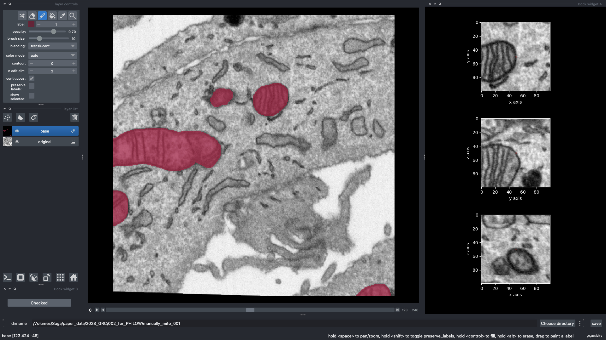
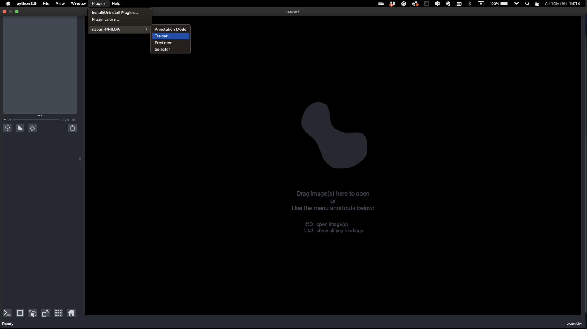

.. usage::

Usage
=====

Annotation Mode
---------------

Launch napari
^^^^^^^^^^^^^

.. code-block::

    napari

Load dataset
^^^^^^^^^^^^

1. Plugins > napari-PHILOW > Annotation Mode

.. image:: images/image_001.jpeg

2. Select original dir 

.. note::

    All slices must be in separate PNG and must be sequentially numbered (e.g. 000.png, 001.png ...).

3. Select mask dir

.. note::

    To resume from the middle of the annotation, specify here the name of the directory containing the mask image. 
    The directory must contain the same number of files with the same name as the original image.
    If you are starting a completely new annotation, you do not need to specify a directory. 
    The directory for mask is automatically created and blank images are generated and stored.

4. Enter a name for the label or model you want to create

.. note::

    This name will be used as the directory name of the newly created mask dir if no mask dir is specified, and as the name of the csv file for training dataset management.

5. Check if you want to create new dataset (new model) 

.. note::

    When checked, if there is already a csv file for training dataset management, a new csv file with one sequential number will be generated.

6. Start tracing

Create labels
^^^^^^^^^^^^^

.. note::

    Create a label with the brush function. more information → https://napari.org/tutorials/fundamentals/labels.html

Training Mode
-------------

Launch napari
^^^^^^^^^^^^^

.. code-block::

    napari

Load dataset
^^^^^^^^^^^^

1. Plugins > napari-PHILOW > Trainer

.. image:: images/image_004.jpeg

2. Select original dir

.. note::

    All slices must be in separate PNG and must be sequentially numbered (e.g. 000.png, 001.png ...).

3. Select labels dir

.. note::

    All label images should be named same as original images and contains data management csv file.

4. Select dir for save trained model

5. Click on the "start training" button

.. image:: images/image_005.jpeg